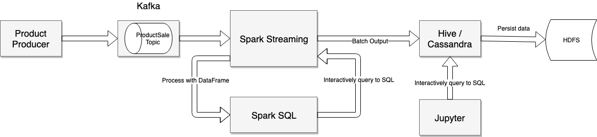

This project contains the demo of the big data technologies such as Hadoop, Spark, Hbase,
Hive, etc.  Instead of using the [Cloudera quickstart distribution](https://hub.docker.com/r/cloudera/quickstart/), which contains the built-in
Hadoop, HBase, etc. and most of them are outdated versions. For example, with the latest Cloudera quickstart
version that released 3 years ago, and its software versions:

* Hadoop: 2.6.0

* HBase: 1.2.0-cdh5.7.0

* Hive: 1.1.0-cdh5.7.0

...

I want to build a distributed standalone environment, which each software run lonely in its own container
and all of them can run well together similar than they work in the production environment. We can upgrade
each service easier by upgrade its image version. This project would be the base toolkit for any of my big data project
later. I hope you find it is useful as well and I am willing to support when you have any problem of running the examples in this project, feel free to submit your ticket!

Requirements
============

* You must install [Docker](https://www.docker.com/) on your machine.

* You should allocate at least 4 GB for your docker. I recommend 6 GB if you have enough resource. Go to Docker Desktop > Preferences > Advanced to configure the available RAM for docker.

I develop the entire project uses Scala, Java on IntelliJ. If you want to enhance this project, I recommend to use IntelliJ as well.

In addition, Java 8 and Scala 2.12 is required.


The technology stack
====================

* Hadoop 2.7.0
* Spark 2.4
* Kafka 2.0.2
* Cassandra 3.0.4
* Hive 2.3.2
* ZooKeeper 3.4.14
* Jupyter latest

Business Model 
===================

It simulates the real e-commerce business, when the customer checks out the cart. While the cart information is saved into the database to proceed its order, the parts of the cart info such as product information could be broadcasted to Kafka topic, be processed by Spark streaming, then be stored in Hadoop HDFS files (or Cassandra tables). The data engineer can query such data and display the reports on Jupyter notebook.   



How to run the demo
===================

I provide the running scripts for both Linux/MacOS and Windows. You should run the bat file if you want to run this demo on Windows. 


## Start all services

Run the script `run-all-services.sh`, this script just call the `docker-compose` to run all necessary containers of Hadoop, Kafka, Spark, Jupyter, etc.  After running this script, you need to wait for a while to let all containers finish their start up successfully. It takes a couple of minutes depends on your machine power.

## Run kafka producer

Run the script `client-producer.sh` to simulate the checkout process, it will send the fake data of the product order to the Kafka topic name `cart-topic`

## Deploy and run Spark streaming job

Run the script `spark-stream-hive-submit.sh` to deploy the spark streaming job to the spark master server. This job will receive the message from kafka topic `cart-topic` and save batch data to Hadoop HDFS by using Hive SQL.

## Verify data on HDFS

Access the hadoop namenode (or datanode)

```cmd
docker exec -it namenode bash
```

, then list all files in the folder `/user/hive/warehouse/productsale` by command

```cmd
hdfs dfs -ls /user/hive/warehouse/productsale
```

All of generated files by Spark streaming job done via Hive SQL. This is an example list

```text
...
-rwxrwxr-x   3 root supergroup       6627 2019-07-04 16:03 /user/hive/warehouse/productsale/part-00000-e8a73c1c-3b72-446d-971a-10c70dd37b53-c000
-rwxrwxr-x   3 root supergroup       6086 2019-07-04 16:05 /user/hive/warehouse/productsale/part-00000-ea6ad193-f9c6-4d8d-bbe0-cd1f96d54b94-c000
-rwxrwxr-x   3 root supergroup       5741 2019-07-04 16:18 /user/hive/warehouse/productsale/part-00000-eee84eea-5618-4e86-b2fd-4df5ce9a2ed3-c000
-rwxrwxr-x   3 root supergroup       6263 2019-07-04 16:17 /user/hive/warehouse/productsale/part-00000-f202c247-29e7-4601-b897-4a26dc9853ab-c000
-rwxrwxr-x   3 root supergroup       5937 2019-07-04 16:15 /user/hive/warehouse/productsale/part-00000-f3bda182-fd1a-43df-b1ea-16c1feb121a8-c000
-rwxrwxr-x   3 root supergroup       6163 2019-07-04 16:06 /user/hive/warehouse/productsale/part-00000-fab37dd3-1d57-43b0-9877-ea02a9012daa-c000
-rwxrwxr-x   3 root supergroup       6462 2019-07-04 16:14 /user/hive/warehouse/productsale/part-00000-fc90e8ae-60eb-4ee6-b759-6daad99c7582-c000
```

You can view one HDFS file

```cmd
hdfs dfs -cat /user/hive/warehouse/productsale/part-00000-fc90e8ae-60eb-4ee6-b759-6daad99c7582-c000
```

and see this similar content

```text
HP PavilionHP Laptop676.01561852800
Galaxy S9 PlusSamsung S2397.01561852800
2019 HP FlagshipHP Laptop1266.01561852800
HP PavilionHP Laptop1352.01561852800
Galaxy Note 8Samsung Note998.01561852800
Apple Mac Pro 2018Apple Mac2637.01562371200
HP TouchscreenHP Laptop2088.01562371200
...
```
## Run report on Jupyter

You can run the reports on Jupyter notebook, open the browser and type `http://localhost:8888/notebooks/work/Product%20Sale%20Hive%20Integration%20Report.ipynb`, and enter the password `bigdata-demo`

I use the [PyHive](https://github.com/dropbox/PyHive), and display a several charts using [Matplotlib](https://matplotlib.org). You can create more reports, or using the paging to query data for the better performance result instead of using `fetchall` from PyHive cursor.

## Stop all services

If you want to stop all docker containers of this project, simply to execute the script `stop-all-services.sh`, wait for a while to let docker removes all of running containers

Credits
=======

The first version of this project starts with the base project [https://github.com/big-data-europe/docker-hbase](https://github.com/big-data-europe/docker-hbase) when I need to set up the 
couple services of HBase, Hadoop, ZooKeeper. It was fitted to my needs though the HBase is 1.2.6 while I like to work with HBase 2.0.5 so I created the new Dockerfile base on the old ones. Later, 
I added more images like Kafka, Hive and demonstrate my works with Hadoop, Kafka, Spark, Hive, ZooKeeper and more.  


